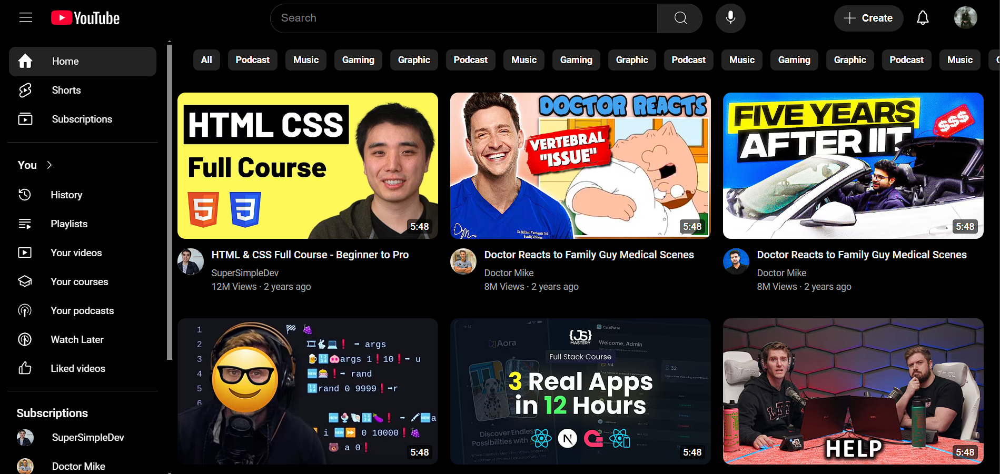
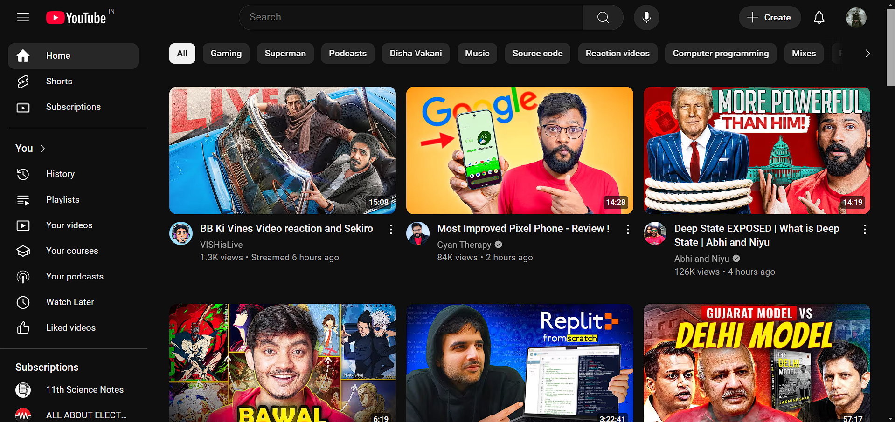

# Youtube-Frontend-only
[URL to see website online](https://pratham8530.github.io/Youtube-Frontend-only/)

Welcome to my first web development project! This repository showcases my journey in learning HTML and CSS, where I challenged myself to replicate the UI of YouTube's homepage. It focuses on the frontend only, with no backend or functionality included.

## Project Overview
This project represents my first steps into web development. The goal was to:
Understand and apply HTML for structure,
Use CSS for styling and layout and
practice designing responsive and clean user interfaces.

While it's not an exact replica, I learned a lot through the process and am excited to share the results.

**Features**
- Header with Navigation Bar: Includes a search bar, logo, and icons.
- Video Thumbnails: Styled grid layout showcasing mock video previews.
- Responsive Design: Adjusts layout for different screen sizes.

| **My Work** | **Actual YouTube** |
|----------------|--------------------|
|  |  |

**Future Improvements**
- Add interactivity with JavaScript.
- Use a CSS framework like Bootstrap for faster development.
- Create a dynamic backend to simulate real YouTube functionality.

